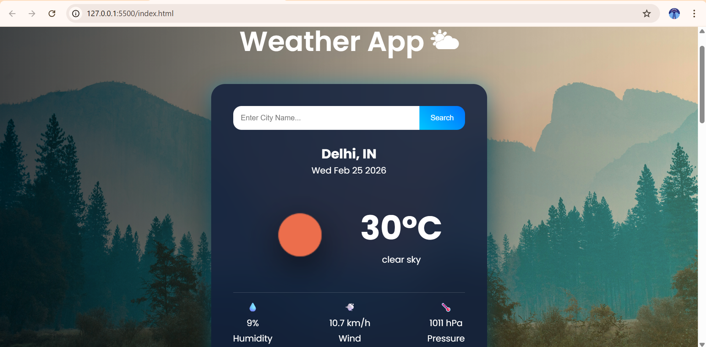
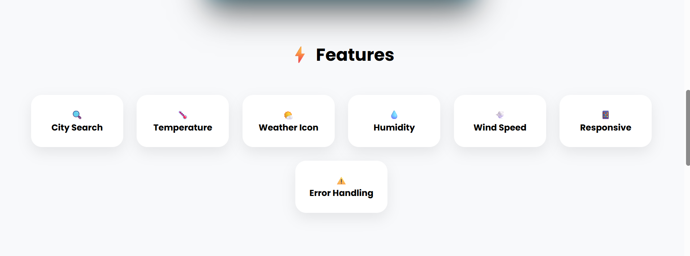
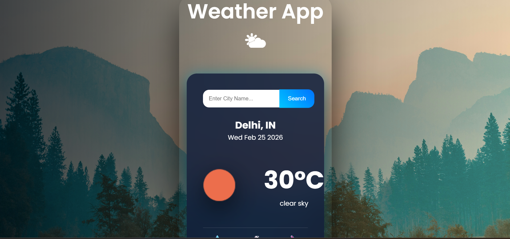
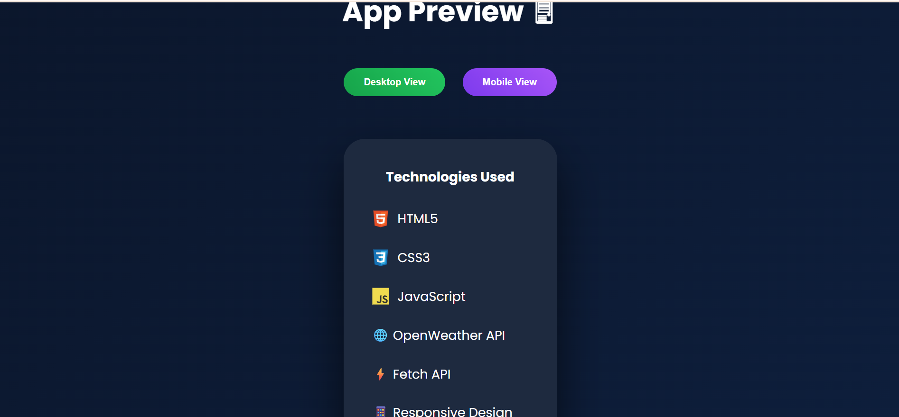

# 🌦 Modern Weather Forecast Web App

A modern and responsive Weather Application built using HTML, CSS, and JavaScript.  
This app fetches real-time weather data and a 5-day forecast using the OpenWeather API.

---

## 🚀 Features

- 🔍 Search weather by city name
- 🌡 Real-time temperature display
- 📅 Current date display
- 🌤 Dynamic weather icons
- 🎨 Weather-based dynamic background
- 💧 Humidity, Wind Speed, Pressure details
- 📊 5-Day Forecast with horizontal scroll
- 📱 Responsive Design (Desktop & Mobile Toggle)
- ⚠ Error handling for invalid city names

---

## 🛠 Tech Stack

- HTML
- CSS
- JavaScript
- OpenWeather API
- Fetch API

---

## 📷 Screenshots

###  Main UI


###  5 Day Forecast


###  Features Section


###  Mobile View


###  App Preview


## ⚙ How To Run

1. Clone the repository
2. Open `script.js`
3. Add your own OpenWeather API key:
   
```javascript
const apiKey = "YOUR_API_KEY_HERE";